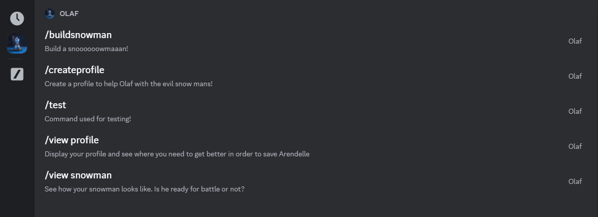

# Saving_Olaf

In a far far away kingdom, Arendelle, surrounded by enormous mountains and valleys, with such beauty that once you visit this place, your soul does not want to ever leave, especially in the winter 👀, lives the friendliest snowman known to man, Olaf, a very kind, and humble mythical creature.

He likes warm hugs and be there for ones in need, and this make him a true friend for everyone that get to truly know him.

This year, a very harsh winter hit Arendelle, bringing with it a looot of evil snow, creating from the white puffy snow once known, monstruous, scary snow mans, the exactly opposite of our friend, Olaf.

He send messages through his friends for someone who is brave and an experienced adventurer, outside the kingdom to help him and his friends fight the evil snow mans. Through the wind and faith, this message arrived to you. Would you help him win back his winter?

--- 
Saving Olaf is a project designed to bring you back the memories from the childhood. Building a snowman requires time, resources and also, snoow. This process is now transformed in the digital world, with Olaf, a Discord based robot with easy to use commands and with a backstory to keep you entertained.

## Available commands

