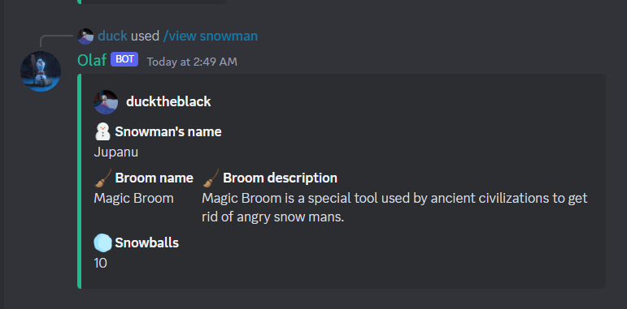
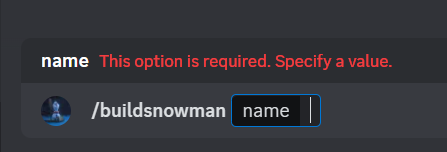

# </img> [Saving_Olaf](https://sebastiankalciov.github.io/Saving_Olaf/)

In a far far away kingdom, **Arendelle**, surrounded by enormous mountains and valleys, with such beauty that once you visit this place, your soul does not want to ever leave 👀, lives the friendliest snowman known to man, **Olaf**, a very kind, and humble mythical creature.

He likes warm hugs and wants to be there for ones in need, making him a true friend for everyone that gets to be around him.

This year, a very harsh winter hit **Arendelle**, bringing with it a looot of evil snow, creating from the white puffy snow once known, monstruous, scary snow mans, the exactly opposite of our friend, **Olaf**.

He send messages through his friends for someone who is brave and an experienced adventurer, outside the kingdom to help him and his friends fight the evil snow mans. Through the wind and faith, this message arrived to you.  
### Would you help him win back his winter?
---
**Saving Olaf** is a project designed to bring you back the memories from the childhood. Building a snowman requires time, resources and also, snoow, that unfortunately not all of us have enough of it.  
This process is now transformed in the digital world, with **Olaf**, a **Discord** based robot with easy to use commands and with a backstory to keep you entertained.  
You can invite him into your server by accessing the github pages. [Click me](https://sebastiankalciov.github.io/Saving_Olaf/)
## 🤖 Available features:
✅ - Create a profile using only one command
  
✅ - Build a snowman by only passing it's name  
  
✅ - Display your profile/snowman to see how you stand in the battle field against the evil snow mans  
  
✅ - Fool Proof  

## ⌨️ Features to be added:
❎ - Fight evil snowmans using magical snowballs  
❎ - Equip different types of clothing, brooms, pots, etc  
❎ - More mini-stories to keep the users entertained
## 🛠️ Dependencies:
- [Node.js](https://nodejs.org/en)
- [Discord.js](https://discord.js.org/)
- [Sequelize](https://sequelize.org/)
- [Sqlite3](https://www.npmjs.com/package/sqlite3)
- [Nodemon](https://www.npmjs.com/package/nodemon)
